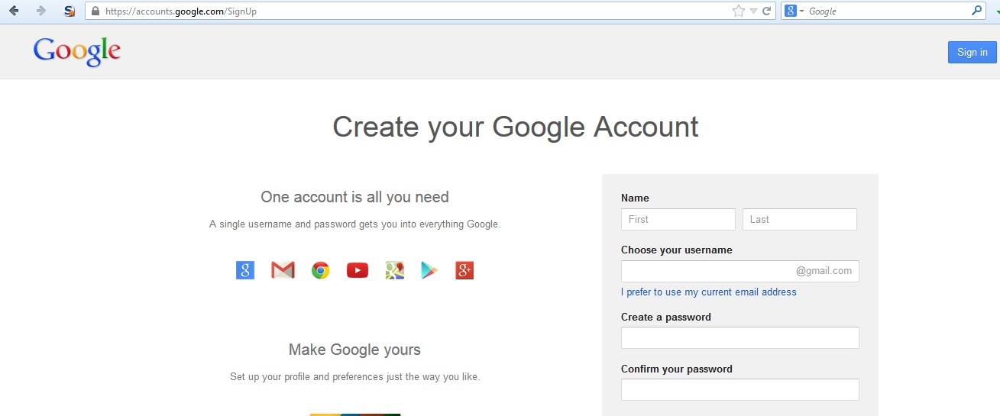

---

layout: col-document
title: WSTG - Latest
tags: WSTG

---
# Test User Registration Process

|ID            |
|--------------|
|WSTG-IDNT-02|

## Summary

Some websites offer a user registration process that automates (or semi-automates) the provisioning of system access to users. The identity requirements for access vary from positive identification to none at all, depending on the security requirements of the system. Many public applications completely automate the registration and provisioning process because the size of the user base makes it impossible to manage manually. However, many corporate applications will provision users manually, so this test case may not apply.

## Test Objectives

1. Verify that the identity requirements for user registration are aligned with business and security requirements.
2. Validate the registration process.

## How to Test

Verify that the identity requirements for user registration are aligned with business and security requirements:

1. Can anyone register for access?
2. Are registrations vetted by a human prior to provisioning, or are they automatically granted if the criteria are met?
3. Can the same person or identity register multiple times?
4. Can users register for different roles or permissions?
5. What proof of identity is required for a registration to be successful?
6. Are registered identities verified?

Validate the registration process:

1. Can identity information be easily forged or faked?
2. Can the exchange of identity information be manipulated during registration?

### Example

In the WordPress example below, the only identification requirement is an email address that is accessible to the registrant.

\
*Figure 4.3.2-1: Wordpress Registration Page*

In contrast, in the Google example below the identification requirements include name, date of birth, country, mobile phone number, email address and CAPTCHA response. While only two of these can be verified (email address and mobile number), the identification requirements are stricter than WordPress.

\
*Figure 4.3.2-2: Google Registration Page*

## Tools

A HTTP proxy can be a useful tool to test this control.

## References

[User Registration Design](https://mashable.com/2011/06/09/user-registration-design/)

## Remediation

Implement identification and verification requirements that correspond to the security requirements of the information the credentials protect.
