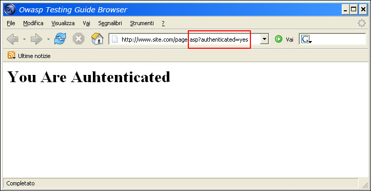
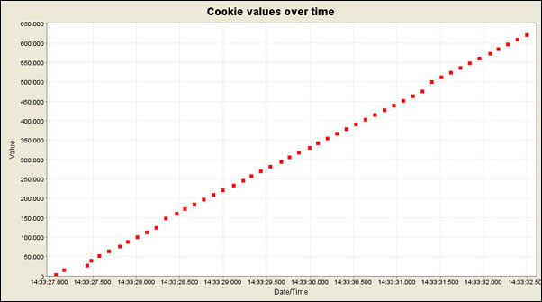

# Testing for Bypassing Authentication Schema

## Summary

While most applications require authentication to gain access to private information or to execute tasks, not every authentication method is able to provide adequate security. Negligence, ignorance, or simple understatement of security threats often result in authentication schemes that can be bypassed by simply skipping the log in page and directly calling an internal page that is supposed to be accessed only after authentication has been performed.

In addition, it is often possible to bypass authentication measures by tampering with requests and tricking the application into thinking that the user is already authenticated. This can be accomplished either by modifying the given URL parameter, by manipulating the form, or by counterfeiting sessions.

Problems related to the authentication schema can be found at different stages of the software development life cycle (SDLC), like the design, development, and deployment phases:

- In the design phase errors can include a wrong definition of application sections to be protected, the choice of not applying strong encryption protocols for securing the transmission of credentials, and many more.
- In the development phase errors can include the incorrect implementation of input validation functionality or not following the security best practices for the specific language.
- In the application deployment phase, there may be issues during the application setup (installation and configuration activities) due to a lack in required technical skills or due to the lack of good documentation.

## How to Test

### Black-Box Testing

There are several methods of bypassing the authentication schema that is used by a web application:

- Direct page request ([forced browsing](https://owasp.org/www-community/attacks/Forced_browsing))
- Parameter modification
- Session ID prediction
- SQL injection

#### Direct Page Request

If a web application implements access control only on the log in page, the authentication schema could be bypassed. For example, if a user directly requests a different page via forced browsing, that page may not check the credentials of the user before granting access. Attempt to directly access a protected page through the address bar in your browser to test using this method.

\
*Figure 4.5.4-1: Direct Request to Protected Page*

#### Parameter Modification

Another problem related to authentication design is when the application verifies a successful log in on the basis of a fixed value parameters. A user could modify these parameters to gain access to the protected areas without providing valid credentials. In the example below, the “authenticated” parameter is changed to a value of “yes”, which allows the user to gain access. In this example, the parameter is in the URL, but a proxy could also be used to modify the parameter, especially when the parameters are sent as form elements in a POST request or when the parameters are stored in a cookie.

```html
    http://www.site.com/page.asp?authenticated=no

    raven@blackbox /home $nc www.site.com 80
    GET /page.asp?authenticated=yes HTTP/1.0

    HTTP/1.1 200 OK
    Date: Sat, 11 Nov 2006 10:22:44 GMT
    Server: Apache
    Connection: close
    Content-Type: text/html; charset=iso-8859-1

    <!DOCTYPE HTML PUBLIC "-//IETF//DTD HTML 2.0//EN">
    <HTML><HEAD>
    </HEAD><BODY>
    <H1>You Are Authenticated</H1>
    </BODY></HTML>
```

\
*Figure 4.5.4-2: Parameter Modified Request*

#### Session ID Prediction

Many web applications manage authentication by using session identifiers (session IDs). Therefore, if session ID generation is predictable, a malicious user could be able to find a valid session ID and gain unauthorized access to the application, impersonating a previously authenticated user.

In the following figure, values inside cookies increase linearly, so it could be easy for an attacker to guess a valid session ID.

\
*Figure 4.5.4-3: Cookie Values Over Time*

In the following figure, values inside cookies change only partially, so it's possible to restrict a brute force attack to the defined fields shown below.

\
*Figure 4.5.4-4: Partially Changed Cookie Values*

#### SQL Injection (HTML Form Authentication)

SQL Injection is a widely known attack technique. This section is not going to describe this technique in detail as there are several sections in this guide that explain injection techniques beyond the scope of this section.

\
*Figure 4.5.4-5: SQL Injection*

The following figure shows that with a simple SQL injection attack, it is sometimes possible to bypass the authentication form.

\
*Figure 4.5.4-6: Simple SQL Injection Attack*

### Gray-Box Testing

If an attacker has been able to retrieve the application source code by exploiting a previously discovered vulnerability (e.g., directory traversal), or from a web repository (Open Source Applications), it could be possible to perform refined attacks against the implementation of the authentication process.

In the following example (PHPBB 2.0.13 - Authentication Bypass Vulnerability), at line 5 the unserialize() function parses a user supplied cookie and sets values inside the $row array. At line 10 the user's MD5 password hash stored inside the back end database is compared to the one supplied.

```php
1.  if ( isset($HTTP_COOKIE_VARS[$cookiename . '_sid']) ||
2.  {
3.  $sessiondata = isset( $HTTP_COOKIE_VARS[$cookiename . '_data'] ) ?
4.
5.  unserialize(stripslashes($HTTP_COOKIE_VARS[$cookiename . '_data'])) : array();
6.
7.  $sessionmethod = SESSION_METHOD_COOKIE;
8.  }
9.
10. if( md5($password) == $row['user_password'] && $row['user_active'] )
11.
12. {
13. $autologin = ( isset($HTTP_POST_VARS['autologin']) ) ? TRUE : 0;
14. }
```

In PHP, a comparison between a string value and a boolean value (1 - “TRUE”) is always “TRUE”, so by supplying the following string (the important part is “b:1”) to the unserialize() function, it is possible to bypass the authentication control:

`a:2:{s:11:`“`autologinid`”`;b:1;s:6:`“`userid`”`;s:1:`“`2`”`;}`

## Tools

- [WebGoat](https://owasp.org/www-project-webgoat/)
- [OWASP Zed Attack Proxy (ZAP)](https://www.zaproxy.org)

## References

### Whitepapers

- Mark Roxberry: “PHPBB 2.0.13 vulnerability”
- [David Endler: “Session ID Brute Force Exploitation and Prediction”](https://www.cgisecurity.com/lib/SessionIDs.pdf)
