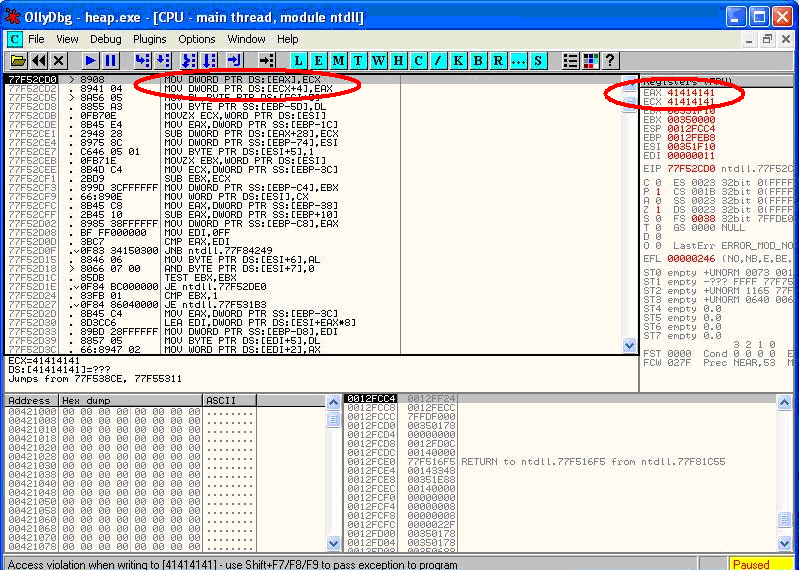

---

layout: col-document
title: WSTG - Latest
tags: WSTG

---
# Testing for Heap Overflow

## Summary

In this test the penetration tester checks whether a they can make a [Heap overflow](https://wiki.owasp.org/index.php/Buffer_Overflows#Heap_Overflow) that exploits a memory segment.

Heap is a memory segment that is used for storing dynamically allocated data and global variables. Each chunk of memory in heap consists of boundary tags that contain memory management information.

When a heap-based buffer is overflowed the control information in these tags is overwritten. When the heap management routine frees the buffer, a memory address overwrite takes place leading to an access violation. When the overflow is executed in a controlled fashion, the vulnerability would allow an adversary to overwrite a desired memory location with a user-controlled value. In practice, an attacker would be able to overwrite function pointers and various addresses stored in structures like GOT, .dtors or TEB with the address of a malicious payload.

There are numerous variants of the heap overflow (heap corruption) vulnerability that can allow anything from overwriting function pointers to exploiting memory management structures for arbitrary code execution. Locating heap overflows requires closer examination in comparison to stack overflows, since there are certain conditions that need to exist in the code for these vulnerabilities to be exploitable.

## How to Test

### Black-Box Testing

The principles of black-box testing for heap overflows remain the same as stack overflows. The key is to supply as input strings that are longer than expected. Although the test process remains the same, the results that are visible in a debugger are significantly different. While in the case of a stack overflow, an instruction pointer or SEH overwrite would be apparent, this does not hold true for a heap overflow condition. When debugging a windows program, a heap overflow can appear in several different forms, the most common one being a pointer exchange taking place after the heap management routine comes into action. Shown below is a scenario that illustrates a heap overflow vulnerability.

\
*Figure 4.8.14-1: Heap Overflow Vulnerability*

The two registers shown, EAX and ECX, can be populated with user supplied addresses which are a part of the data that is used to overflow the heap buffer. One of the addresses can point to a function pointer which needs to be overwritten, for example UEF (Unhandled Exception filter), and the other can be the address of user supplied code that needs to be executed.

When the MOV instructions shown in the left pane are executed, the overwrite takes place and, when the function is called, user supplied code gets executed. As mentioned previously, other methods of testing such vulnerabilities include reverse engineering the application binaries, which is a complex and tedious process, and using fuzzing techniques.

### Gray-Box Testing

When reviewing code, one must realize that there are several avenues where heap related vulnerabilities may arise. Code that seems innocuous at the first glance can actually be vulnerable under certain conditions. Since there are several variants of this vulnerability, we will cover only the issues that are predominant.

Most of the time, heap buffers are considered safe by a lot of developers who do not hesitate to perform insecure operations like `strcpy( )` on them. The myth that a stack overflow and instruction pointer overwrite are the only means to execute arbitrary code proves to be hazardous in case of code shown below:-

```c
int main(int argc, char *argv[])
    {
        ……

        vulnerable(argv[1]);
        return 0;
    }


    int vulnerable(char *buf)
    {

        HANDLE hp = HeapCreate(0, 0, 0);

        HLOCAL chunk = HeapAlloc(hp, 0, 260);

        strcpy(chunk, buf);  ''' Vulnerability'''

                            ……..

        return 0;
    }
```

In this case, if buf exceeds 260 bytes, it will overwrite pointers in the adjacent boundary tag, facilitating the overwrite of an arbitrary memory location with 4 bytes of data once the heap management routine kicks in.

Lately, several products, especially anti-virus libraries, have been affected by variants that are combinations of an integer overflow and copy operations to a heap buffer. As an example, consider a vulnerable code snippet, a part of code responsible for processing `TNEF` filetypes, from Clam Anti Virus 0.86.1, source file `tnef.c` and function `tnef_message( )`:

```c
string = cli_malloc(length + 1); ''' Vulnerability'''
if(fread(string, 1, length, fp) != length) {''' Vulnerability'''
free(string);
return -1;
}
```

The malloc in line 1 allocates memory based on the value of length, which happens to be a 32 bit integer. In this particular example, length is user-controllable and a malicious TNEF file can be crafted to set length to `-1`, which would result in `malloc( 0 )`. Therefore, this malloc would allocate a small heap buffer, which would be 16 bytes on most 32 bit platforms (as indicated in malloc.h).

And now, in line 2, a heap overflow occurs in the call to fread( ). The 3rd argument, in this case length, is expected to be a `size_t` variable. But if it’s going to be `-1`, the argument wraps to `0xFFFFFFFF`, thus copying `0xFFFFFFFF` bytes into the 16 byte buffer.

Static code analysis tools can also help in locating heap related vulnerabilities such as “double free” etc. A variety of tools like RATS, Flawfinder and ITS4 are available for analyzing C-style languages.

## Tools

- [OllyDbg: “A windows based debugger used for analyzing buffer overflow vulnerabilities”](http://www.ollydbg.de)
- [Spike, A fuzzer framework that can be used to explore vulnerabilities and perform length testing](https://www.immunitysec.com/downloads/SPIKE2.9.tgz)
- [Brute Force Binary Tester (BFB), A proactive binary checker](http://bfbtester.sourceforge.net)
- [Metasploit, A rapid exploit development and Testing frame work](https://www.metasploit.com)

## References

### Whitepapers

- [w00w00: “Heap Overflow Tutorial”](https://www.cgsecurity.org/exploit/heaptut.txt)
- [David Litchfield: “Windows Heap Overflows”](https://www.blackhat.com/presentations/win-usa-04/bh-win-04-litchfield/bh-win-04-litchfield.ppt)
